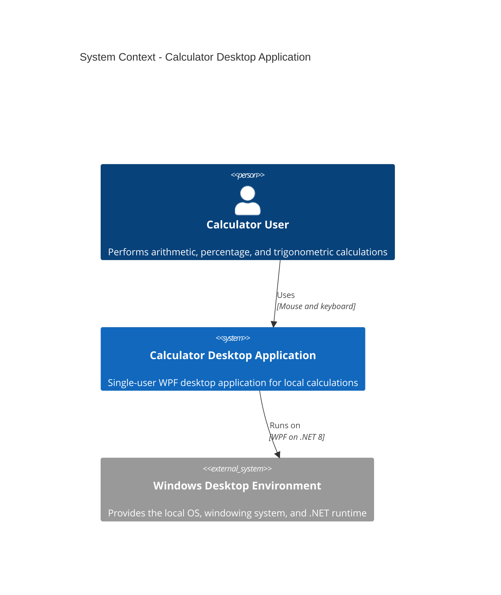
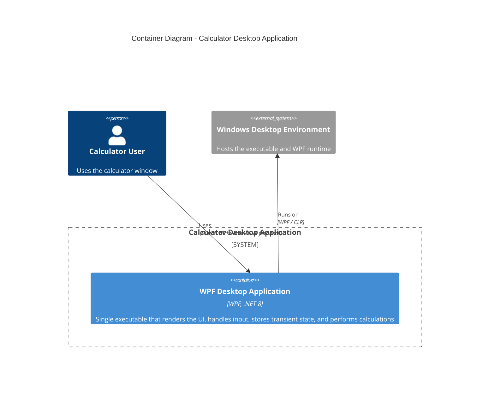
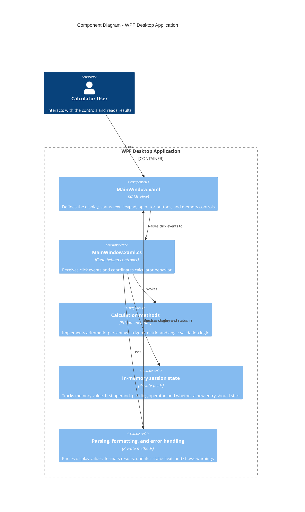
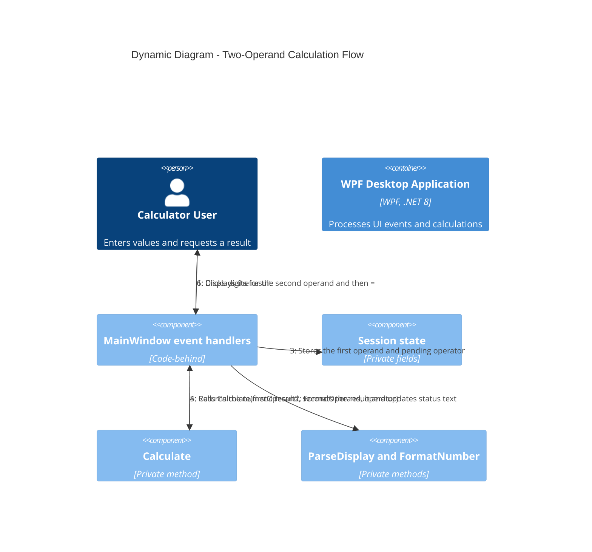
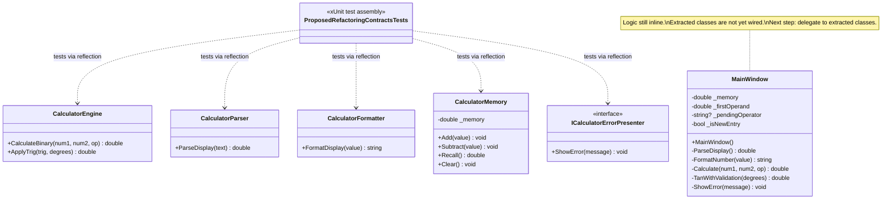
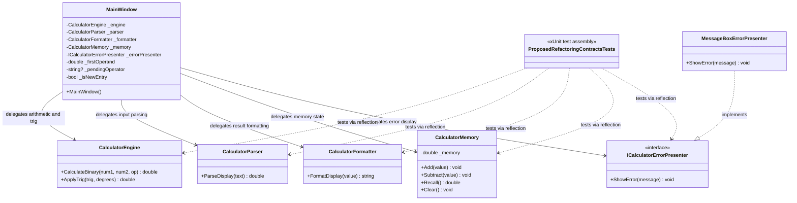

# C4 Diagrams

This document captures the calculator application's architecture using Mermaid C4 diagrams.

## Scope

- System: single-user desktop calculator
- Platform: WPF on .NET 8 for Windows
- Storage: in-memory only
- External integrations: none

## System Context

## Container Diagram

## Component Diagram

## Dynamic Diagram

## Class Dependencies — Current State

The five extracted classes now exist in the `Calculator` namespace alongside `MainWindow`. `MainWindow` has not yet been wired to delegate to them — it still owns its original inline implementations. The test project exercises the extracted classes independently via reflection.

## Class Dependencies — Target State

After wiring, `MainWindow` becomes a thin coordinator that delegates all computation and presentation to the extracted classes. The inline duplicate methods are removed.

## Notes

- The application is a single container because the entire calculator ships as one local desktop executable.
- The component diagram uses logical components inside the executable, even though several responsibilities are implemented within one code-behind file.
- There is no persistent database, network API, or background service in the current design.
- The class dependency diagrams reflect the two stages of the planned refactor: the current parallel state (extracted classes exist but are not wired) and the target thin-coordinator pattern.
